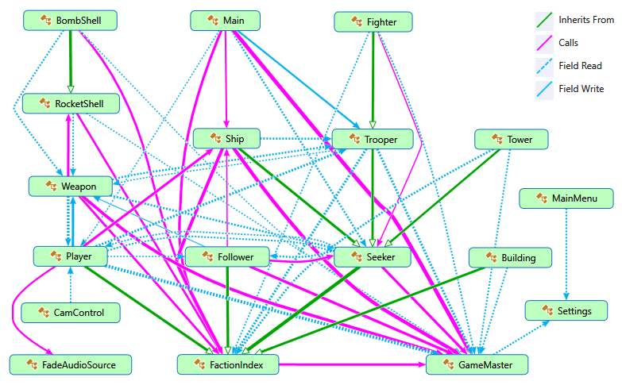

# RTS-Sandbox
C# Unity 3D classes for creation of action / real-time strategy games

## Game Example (Player vs AI vs AI)

## 600 Units Battle (AI vs AI)

## Five Factions Battle (AI vs AI)

## Class Diagram

## Features
- Procedural creation of a randomized RTS battle with opposing factions interactions, simple economic system, building and resource mining
- Two working modes:
  - Player vs AI
  - AI vs AI
- All game logic code was created from scratch
- Game example (videos above) uses free 3d-models, textures and some particle effects from Unity asset store

## Rules

- "All against all" principle
- A selected number of bases (Ship.cs) are placed on the map with physical resource objects (Follower.cs) at any place
- Each faction has own unique color
- AI opponents fight between their bases and the player (Player.cs)
- Resource collector ships (Seeker.cs) of each faction ("factionId" in FactionIndex.cs) find resource objects and take to their bases
- Resources change their colors to faction's color after the object picking up
- AI builds defence towers and factories for units creation with collected resources
- The player controls a small ship, attacks opponents and their bases
- With a given probability, opponents send created units (Trooper.cs, Fighter.cs) to attack player's small ship and base
- The player creates buildings (Building.cs), units, defence towers (Tower.cs), finds resources and takes to the base ship
- The player groups units and gives them orders (follow the object, or attack the enemy)
- Any unit, including the player, can pick up weapons: machine guns, rocket and bomb launchers (Weapon.cs)
- Each unit has a level, which increases after destroying enemies
- Resource is a physical rigidbody object that can be picked up as loot
- All objects can be destroyable

## Usage

- All needed prefabs are listed in GameMaster.cs
- GameMaster.cs acts as a global static class that contains all prefab links for other classes
- Add empty Game Object in Unity Hierarchy
- Attach GameMaster.cs script to the object
- Attach scripts for each prefab:
  - **Player:** Player.cs, PlayerController.cs, Main.cs
  - **Camera:** CamControl.cs
  - **Faction Base Ship:** Ship.cs
  - **Barracs and Factory:** Building.cs
  - **Gun-Tower, Rocket-Tower:** Tower.cs
  - **Trooper:** Trooper.cs
  - **LightShip:** Fighter.cs
  - **Resource Ship:** Seeker.cs
  - **Resource:** Follower.cs
  - **Machine Gun, Bomb Launcher, Rocket Launcher:** Weapon.cs
  - **Rocket:** RocketShell.cs
  - **Bomb:** BombShell.cs
- Place player prefab with a Camera as a child on the map and connect all your other prefabs to GameMaster.cs
